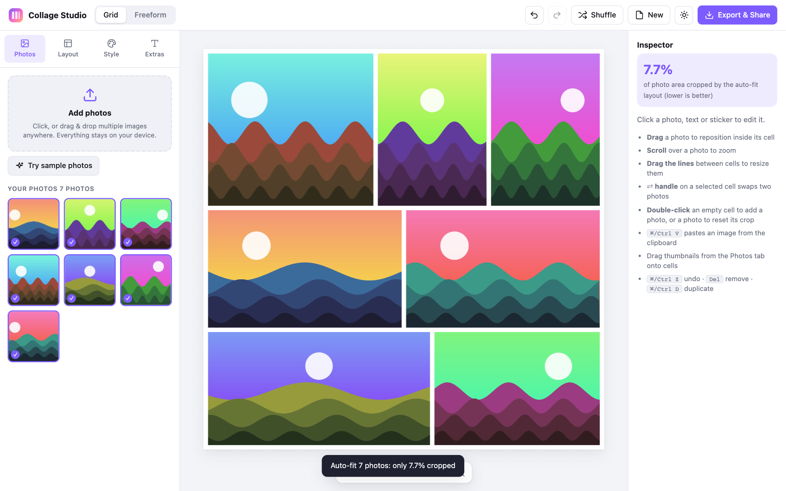
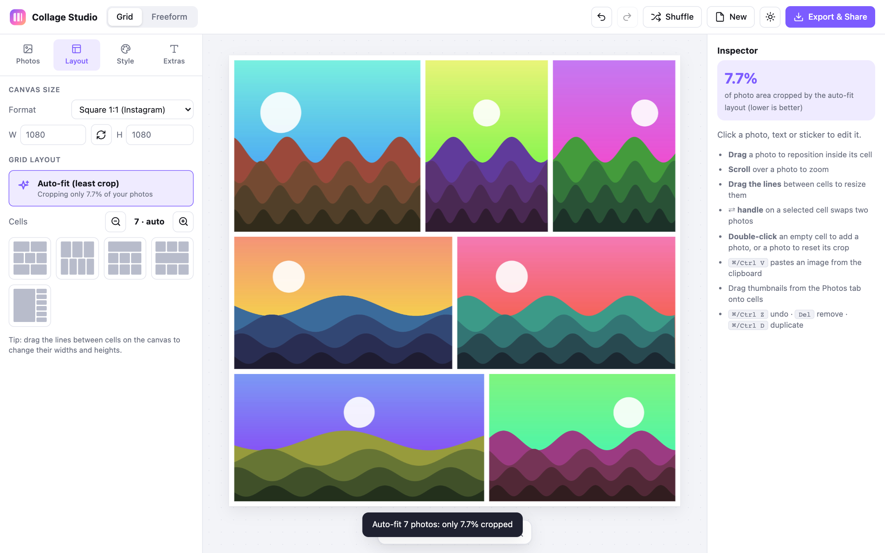
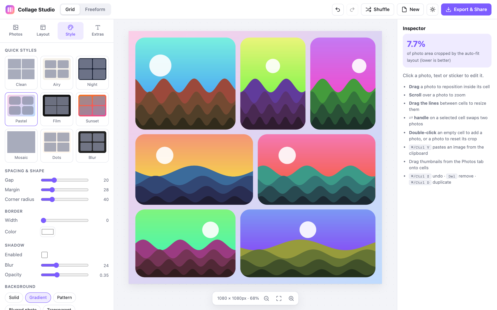
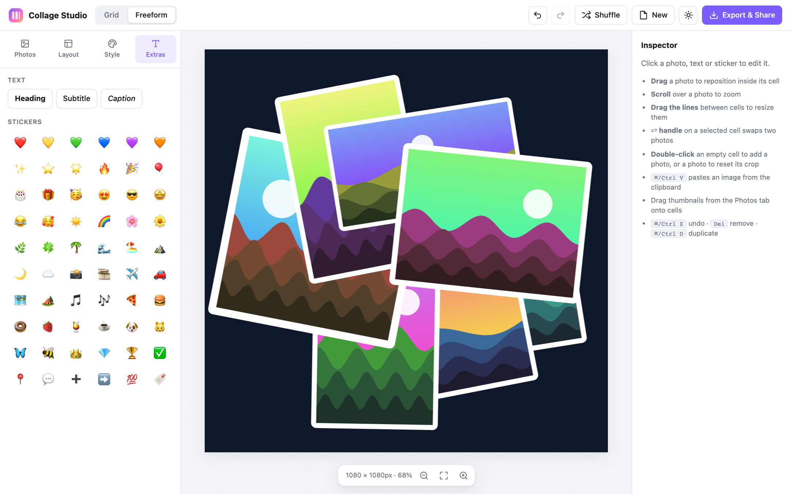
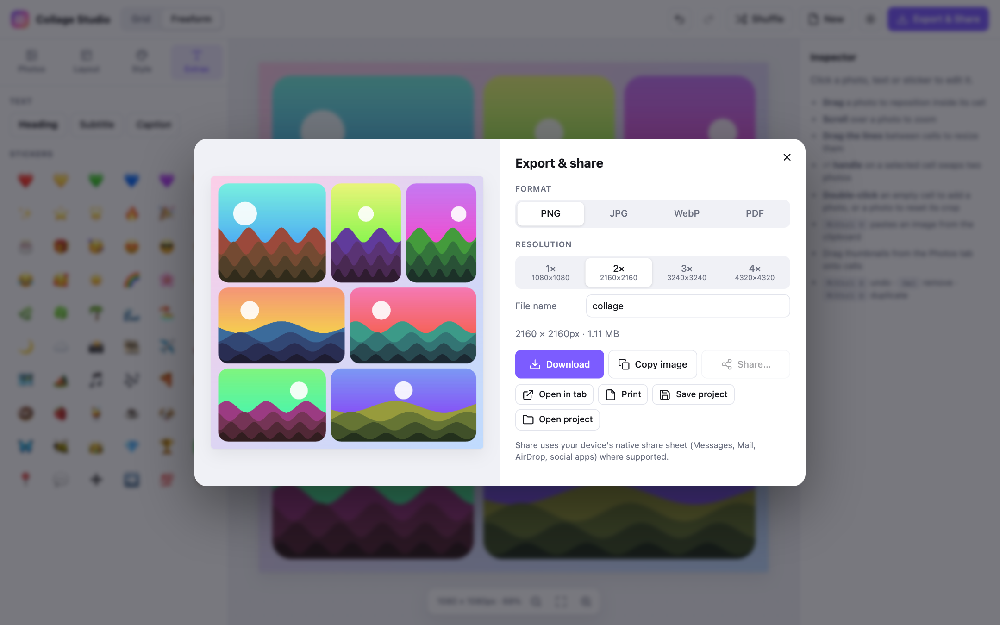

<div align="center">


# Collage Studio

**A fast, private photo collage maker that runs entirely in your browser.**
No sign-up, no uploads, no build step.




</div>

## Features

| | |
|---|---|
| **Auto-fit layouts** | Add photos and the layout with the least cropping is picked for you. |
| **Grid and Freeform** | Resizable grid cells, or scattered, rotated photos. |
| **Quick styles** | One-click themes: Clean, Airy, Night, Pastel, Film, Sunset, Mosaic, Dots, Blur. |
| **Fine control** | Gap, margin, corner radius, border, shadow, solid, gradient, pattern or blurred backgrounds. |
| **Photo filters** | Vivid, Warm, Cool, B&W, Sepia, Fade, Noir, Dreamy, Vintage. |
| **Text and stickers** | Headings, subtitles, captions and an emoji sticker library. |
| **Social presets** | Instagram, Stories, YouTube, Pinterest, Facebook, 3:2 print, A4 and custom sizes. |
| **High-res export** | PNG, JPG, WebP or PDF at 1x to 4x, plus copy, share and print. |
| **Projects** | Save and reopen your work as a file. Undo and redo included. |
| **Works offline** | Installable as an app, with a service worker cache. |

## Quick start

There is nothing to install. Serve the folder with any static server:

```bash
python3 -m http.server 5173
```

Then open <http://localhost:5173> and click **Try sample photos**.

> Serve over `http://localhost` or HTTPS. Opening `index.html` directly with `file://` disables the service worker and PWA install.

## How it works

<table>
<tr>
<td width="50%"><br><b>1. Layout</b><br>Pick a canvas size and a template, or let Auto-fit choose.</td>
<td width="50%"><br><b>2. Style</b><br>Apply a quick style, then tune spacing, borders and background.</td>
</tr>
<tr>
<td width="50%"><br><b>3. Extras</b><br>Switch to Freeform, add text and stickers.</td>
<td width="50%"><br><b>4. Export</b><br>Choose format and resolution, then download or share.</td>
</tr>
</table>

## Shortcuts and gestures

| Action | How |
|---|---|
| Reposition a photo in its cell | Drag it |
| Zoom a photo | Scroll over it |
| Resize cells | Drag the lines between them |
| Swap two photos | Use the swap handle on a selected cell |
| Add or reset a photo | Double-click an empty cell or a photo |
| Paste an image | `Cmd/Ctrl + V` |
| Undo / Redo | `Cmd/Ctrl + Z` / `Cmd/Ctrl + Shift + Z` |
| Duplicate / Remove | `Cmd/Ctrl + D` / `Del` |

## Project structure

```
.
├── index.html            App shell and UI markup
├── css/style.css         Styles (light and dark themes)
├── js/
│   ├── app.js            Editor logic, rendering, export
│   └── data.js           Templates, aspect presets, themes, filters, fonts, stickers
├── vendor/               Konva (canvas) and jsPDF (PDF export), bundled locally
├── sw.js                 Service worker (network first, cache fallback)
├── manifest.webmanifest  PWA manifest
└── docs/                 README screenshots
```

## Privacy

Photos are read with the browser File API and drawn to a local canvas. Nothing is uploaded, and no analytics or external requests are made. All dependencies are bundled in `vendor/`.

## Built with

[](https://konvajs.org)
[](https://github.com/parallax/jsPDF)
